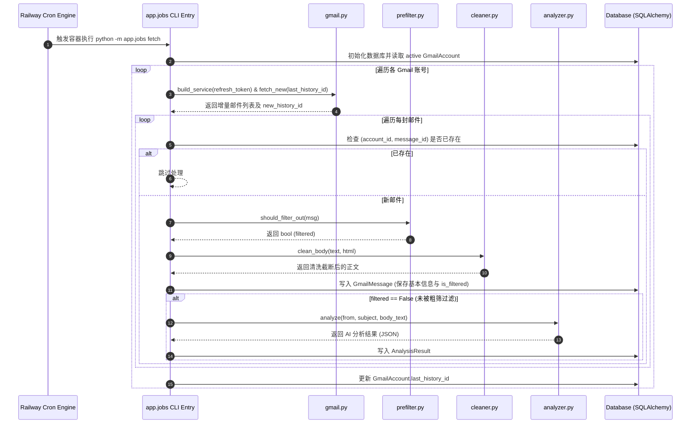
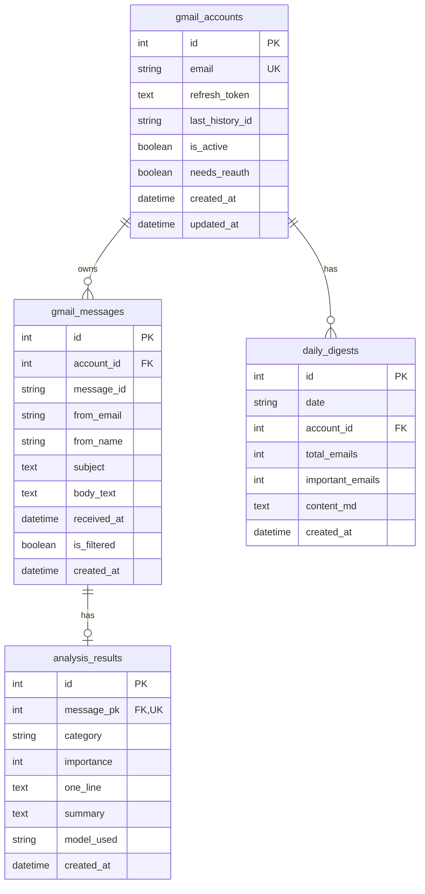
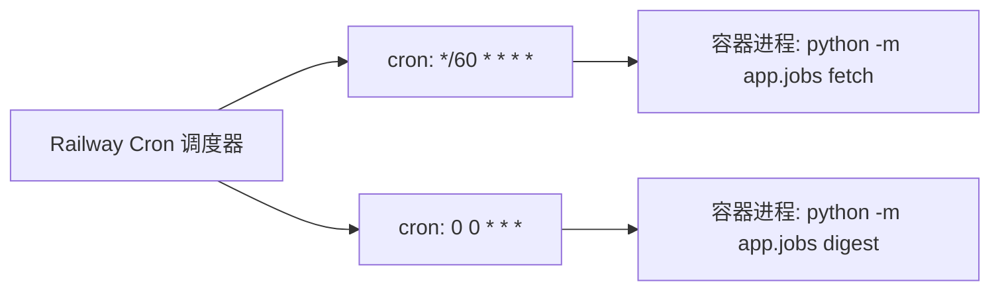

# PROJECT_CONTEXT.md — Gmail AI 邮件分析系统 (AI 开发入口与系统上下文)

> ⚠️ **所有 AI 助手（Claude Code、Cursor、ChatGPT、Antigravity 等）必读指南**：
> 在修改、新增或重构本项目任何代码之前，必须先完整阅读并理解本文档。文档内容完全来源于仓库内真实代码实现（基于 `app/`、`scripts/`、`templates/`、`static/` 等目录），禁止凭空编造设计。若代码实现与历史设计文档存在冲突，一律以代码真实实现为准。

---

## 目录
1. [项目定位 (Project Positioning)](#1-项目定位-project-positioning)
2. [系统架构与数据流 (System Architecture)](#2-系统架构与数据流-system-architecture)
3. [系统目录说明 (Directory Structure)](#3-系统目录说明-directory-structure)
4. [业务能力说明 (Business Capabilities)](#4-业务能力说明-business-capabilities)
5. [核心模块说明 (Core Modules)](#5-核心模块说明-core-modules)
6. [数据库设计说明 (Database Design)](#6-数据库设计说明-database-design)
7. [API 接口文档 (API Documentation)](#7-api-接口文档-api-documentation)
8. [配置项说明 (Configuration)](#8-配置项说明-configuration)
9. [定时任务与后台 Job (Scheduled Tasks)](#9-定时任务与后台-job-scheduled-tasks)
10. [Web 页面说明 (Web UI & Pages)](#10-web-页面说明-web-ui--pages)
11. [代码规范与部署 (Coding Standards & Deployment)](#11-代码规范与部署-coding-standards--deployment)
12. [技术债与已知风险 (Technical Debt & Risks)](#12-技术债与已知风险-technical-debt--risks)
13. [文件与目录清理建议 (Deletion Recommendations)](#13-文件与目录清理建议-deletion-recommendations)
14. [AI 开发规范 (AI Development Rules)](#14-ai-开发规范-ai-development-rules)

---

## 1. 项目定位 (Project Positioning)

### 1.1 项目是做什么的？
**Gmail AI 邮件分析系统**（系统与 UI 品牌名称 **RHMail AI**，内部项目名 `rhmail`）是一个轻量级、自建单用户的个人 AI 邮件助手。系统通过云平台定时任务（Railway Crons / CLI 脚本）自动连接多个 Gmail 邮箱，增量同步新邮件，经过规则预过滤、HTML/正文清洗后，调用 OpenAI 兼容的 LLM 模型对邮件进行智能分类与重要度分级（1-5级），提取一句话总结与关键要点，并自动生成每日 Markdown 邮件日报，同时提供现代极简风格的 Web 看板（含 SVG 图标与指标卡片）供用户浏览、筛选和查阅。

### 1.2 主要解决什么问题？
* **邮件信息过载**：个人每日接收大量营销邮件、系统通知与订阅内容，核心重要邮件容易被淹没。
* **多邮箱管理成本高**：需要频繁切换不同 Gmail 账号查看新邮件。
* **隐私与自主可控**：不依赖第三方 SaaS 平台，基于 Gmail 官方 OAuth 2.0 只读权限与自行指定的 LLM 网关/模型（如 DeepSeek、GPT-4o-mini），数据完全存储在本地或自建数据库中。

### 1.3 核心能力
1. **多 Gmail 账号 OAuth 增量同步**：支持动态配置任意数量的 Gmail 账号，基于 Gmail History API 实现低延迟增量同步，配有历史断续时的 Timestamp 回溯补齐机制。
2. **两阶段降本规则过滤与清洗**：通过黑白名单、退订 Header (`List-Unsubscribe`)、营销正则进行粗筛丢弃；对留存邮件自动解析 HTML/Plain Text，剔除引用回复与签名，并按设定字符数（默认 2000 字）截断。
3. **LLM 结构化分析**：严格输出 JSON 结构，提取 6 大精准分类、1-5 级重要度分级、一句话概要及重点邮件（重要度 $\ge 4$）要点摘要。
4. **自动化每日总结（Daily Digest）**：每日定时汇总当日所有解析邮件，按分类与重要度倒序生成格式化的 Markdown 日报。
5. **架构解耦的进程级 Job 执行**：移除嵌入式定时器，解耦为独立 CLI 命令（`python -m app.jobs fetch|digest`），原生适配 Railway Crons 等云端无状态定时调度。
6. **精致响应式 Web 管理看板 (RHMail AI)**：内置基于 Cookie 签名的轻量级密码认证，提供视觉升级的概览统计、多维度邮件筛选列表、邮件详情查看以及历史日报归档浏览。

### 1.4 非目标 (Non-Goals)
* ❌ **非多租户 SaaS 系统**：不提供用户注册、多租户隔离、权限分配及计费功能。
* ❌ **不支持邮件发送与回复**：仅申请 `gmail.readonly` 只读权限，绝不提供写邮件、发邮件或自动回复功能。
* ❌ **不内置客户端或 APP**：仅提供基于 Jinja2 模板的响应式 Web 页面，不做 Native APP 或客户端插件。
* ❌ **不做复杂的模型路由与成本统计**：直接调用配置的统一 OpenAI 兼容端点，不集成 LiteLLM、LangChain 等重型框架，不做 Token 消耗与成本分析。

---

## 2. 系统架构与数据流 (System Architecture)

系统基于 Python 3.11 + FastAPI 架构构建，数据库采用 SQLAlchemy 2.0 ORM（兼容 SQLite 与 PostgreSQL）。Web 常驻服务与定时后台任务完全解耦：Web 服务由 Uvicorn 运行，定时任务由云平台（Railway Crons）单独调起容器命令执行 `python -m app.jobs`。

### 2.1 系统总体架构图 (Mermaid)

```mermaid
graph TD
    subgraph 外部服务 (External Services)
        GCP[Google Gmail API]
        LLM[OpenAI 兼容 LLM 网关]
    end

    subgraph 独立进程 / 部署层 (Deployment Units)
        subgraph Railway Cron 独立进程
            CRON_FETCH[Cron: */60 * * * *<br/>python -m app.jobs fetch]
            CRON_DIGEST[Cron: 0 0 * * *<br/>python -m app.jobs digest]
        end

        subgraph FastAPI Web 常驻进程
            AP[Uvicorn / FastAPI Web Engine]
            AUTH[Auth 认证模块 (itsdangerous)]
        end

        subgraph 核心处理管道 (Processing Pipeline)
            GMAIL[Gmail 模块]
            FILTER[Prefilter 预过滤]
            CLEAN[Cleaner 正文清洗]
            ANALYZER[Analyzer AI 分析]
            DIGEST[Digest 日报生成]
        end

        ORM[SQLAlchemy ORM (db.py / models.py)]
    end

    subgraph 存储 (Storage)
        DB[(SQLite / PostgreSQL)]
    end

    subgraph 用户交互 (Client)
        BROWSER[浏览器 RHMail AI 看板]
    end

    %% 数据与调用关系
    CRON_FETCH --> GMAIL
    GMAIL -->|OAuth 2.0| GCP
    GMAIL -->|原始邮件| CRON_FETCH
    CRON_FETCH --> FILTER
    CRON_FETCH --> CLEAN
    CRON_FETCH --> ANALYZER
    ANALYZER -->|HTTP Async| LLM
    
    CRON_DIGEST --> DIGEST

    CRON_FETCH --> ORM
    CRON_DIGEST --> ORM
    AP --> ORM
    ORM --> DB

    BROWSER -->|HTTP / Cookie| AP
    AP --> AUTH
```

### 2.2 数据流动与处理链路图



---

## 3. 系统目录说明 (Directory Structure)

```
/Users/tyrone/Desktop/code/rhmail/
├── Dockerfile                      # [核心] Docker 容器镜像构建脚本 (Python 3.11-slim)
├── Gmail-AI-Email-Analysis-Tech-Spec.md # [历史/参考] 详细技术规格说明文档
├── gmail-ai-技术开发方案.md          # [历史/参考] 原始技术开发方案文档
├── gmail-ai-邮件分析系统-精简版.md    # [历史/参考] 产品与技术框架精简版文档
├── railway.toml                    # [核心] Railway 云平台部署配置文件 (定义 Web 服务与 Cron 任务)
├── requirements.txt                # [核心] Python 依赖包及其精确版本定义
├── .env.example                    # [核心] 环境变量模版文件
├── app/                            # [核心] 业务代码主目录
│   ├── __init__.py                 # 包初始化文件
│   ├── config.py                   # [核心] 全局配置加载模块 (读取环境变量)
│   ├── db.py                       # [核心] 数据库 Engine 与 Session 初始化
│   ├── models.py                   # [核心] SQLAlchemy ORM 数据模型定义
│   ├── auth.py                     # [核心] Session Cookie 签验与路由鉴权依赖
│   ├── oauth.py                    # [核心] Google OAuth 2.0 Web 授权流程 (构建授权URL、交换Token、获取邮箱地址)
│   ├── gmail.py                    # [核心] Gmail API 数据拉取与增量同步
│   ├── prefilter.py                # [核心] 规则预过滤模块 (黑白名单/退订/主题正则)
│   ├── cleaner.py                  # [核心] HTML 转文本、引用/签名剥离与正文截断
│   ├── analyzer.py                 # [核心] LLM API 调用与 JSON 格式解析
│   ├── digest.py                   # [核心] Markdown 邮件日报渲染引擎
│   ├── jobs.py                     # [核心] 任务执行引擎与 CLI 独立脚本入口 (python -m app.jobs fetch|digest)
│   └── main.py                     # [核心] FastAPI 应用入口、路由与 HTML 模板渲染
├── scripts/                        # [辅助/工具] 运维与辅助脚本
│   ├── __init__.py                 # 包初始化文件
│   └── authorize.py                # [辅助工具] 本地 CLI 获取 Gmail OAuth Refresh Token (已被 Web OAuth 替代)
├── static/                         # [核心] Web 静态资源目录
│   └── style.css                   # 全站 CSS 样式表 (RHMail AI 视觉主题、SVG 效果、响应式、账号管理组件)
└── templates/                      # [核心] Jinja2 HTML 页面模板 (包含现代 SVG 图标组件)
    ├── base.html                   # 基础布局模板 (TopBar, RHMail AI 品牌导航，含「邮箱」入口)
    ├── login.html                  # 密码登录页面 (带品牌 Logo)
    ├── dashboard.html              # 概览看板主页 (指标卡片、分类分布、最近日报)
    ├── accounts.html               # 邮箱管理页面 (添加/禁用/重新授权/删除 Gmail 账号)
    ├── emails.html                 # 邮件列表页 (多维度筛选、精准图标、分页)
    ├── email_detail.html           # 邮件详情页 (AI 核心提炼卡片与正文)
    ├── digests.html                # 历史日报归档列表页
    └── digest_detail.html          # 日报详情页 (渲染 Markdown 预格式文本)
```

### 目录组件评估分类：
* **核心目录/文件（不可删除）**：`app/`, `static/`, `templates/`, `scripts/authorize.py`, `Dockerfile`, `railway.toml`, `requirements.txt`, `.env.example`。
* **已删除文件**：`app/scheduler.py` 已被正式移除，后台任务完全由云端 Cron / CLI 独立进程调度。
* **参考文档（可暂留或统一归档）**：`Gmail-AI-Email-Analysis-Tech-Spec.md`, `gmail-ai-技术开发方案.md`, `gmail-ai-邮件分析系统-精简版.md` 属于项目早期设计文档。

---

## 4. 业务能力说明 (Business Capabilities)

### 4.1 功能一：Gmail 账号授权与邮箱管理
* **作用**：用户可在 Web 后台通过 OAuth 2.0 Web 流程添加 Gmail 账号，获取具有 `gmail.readonly` 权限的持久化 `refresh_token`，并自动存入数据库。
* **入口**：Web 后台 `/accounts` 页面，点击「添加 Gmail 邮箱」按钮发起 OAuth 授权。也保留了 CLI 脚本 `python scripts/authorize.py` 作为备用。
* **核心流程**：
  1. 用户点击「添加 Gmail」→ 系统构建 Google OAuth URL 并重定向到 Google 授权页。
  2. 用户授权后回调到 `/oauth/callback`，系统用授权码换取 `refresh_token` 并调用 Gmail API 获取邮箱地址。
  3. 账号信息写入 `gmail_accounts` 表，自动加入同步列表。
* **管理能力**：启用/禁用同步开关、重新授权 (Token 失效时)、删除账号及其所有关联数据。
* **环境变量种子**：环境变量 `GMAIL_EMAIL_N` / `GMAIL_REFRESH_TOKEN_N` 保留为可选初始种子，首次启动时自动导入数据库，Web 授权的 Token 不会被环境变量覆盖。
* **依赖配置**：`GOOGLE_CLIENT_ID`, `GOOGLE_CLIENT_SECRET`, `OAUTH_REDIRECT_URI`。
* **风险点**：若在 GCP Console 中未将 OAuth 应用发布为 **Production** 状态，获取的 Refresh Token 将在 7 天后强制失效，引发 `google.auth.exceptions.RefreshError`。

### 4.2 功能二：定时增量邮件拉取与同步 (CLI 独立执行)
* **作用**：定时拉取已激活 Gmail 账号的最新邮件。
* **入口**：终端运行 `python -m app.jobs fetch`（在云平台上由 `railway.toml` 配合 `[[crons]]` 触发）。
* **核心流程**：
  1. 校验环境变量与 DB 中的账号同步状态 (`_sync_accounts_from_config`)。
  2. 若账号存有 `last_history_id`，优先调用 Gmail History API (`list_added_ids_via_history`) 进行毫秒级增量拉取。
  3. 若 History API 返回 404 (History ID 过期失效) 或首次运行（`last_history_id` 为空），自动回退至 Timestamp 回溯机制 (`list_message_ids_since`)，按 `BACKFILL_DAYS`（默认2天）拉取。
  4. 解析邮件 Header（发件人、主题、日期、List-Unsubscribe）与 MIME Body。
* **涉及数据**：更新 `gmail_accounts` 表中的 `last_history_id`，若遇到 `RefreshError` 则标记 `needs_reauth = True`。

### 4.3 功能三：邮件规则预过滤 (Prefilter) 与正文清洗
* **作用**：以极低成本过滤高频营销垃圾邮件，并提取纯净的邮件正文。
* **入口**：`app/prefilter.py` 的 `should_filter_out()`，`app/cleaner.py` 的 `clean_body()`。
* **匹配规则**（优先级自上而下）：
  1. 白名单命中 (`WHITELIST_FROM`) ➔ 绝对保留 (`False`)。
  2. 黑名单命中 (`BLACKLIST_FROM`) ➔ 过滤丢弃 (`True`)。
  3. 含有 `List-Unsubscribe` 响应头 ➔ 过滤丢弃 (`True`)。
  4. 主题匹配正则 `(unsubscribe|newsletter|促销|优惠|限时|退订)` ➔ 过滤丢弃 (`True`)。
* **清洗逻辑**：若无 Plain Text，使用 BeautifulSoup 解析 HTML 并剥离 `<script>` 与 `<style>`；利用行匹配剔除 `>` 引用回复；剥离常见签名分隔符（如 `\n-- \n`, `\nSent from `）；最终按 `BODY_MAX_CHARS`（默认2000字）截断并附加 `…(截断)` 标识。

### 4.4 功能四：AI 智能分级与摘要分析
* **作用**：调用 LLM 对未被过滤的邮件进行分类、评分与总结。
* **入口**：`app/analyzer.py` 的 `analyze()`。
* **核心流程**：发送包含系统 Prompt 的 Prompt 结构，开启 `response_format: {"type": "json_object"}` 和 `temperature: 0.2`。
* **分析分类**：固定为 6 种分类（`紧急·需回复`、`金融·账户告警`、`法律·合同`、`重要通知`、`订阅·营销`、`社交其他`）。
* **分析评分**：`importance` 整数 1-5。仅当 `importance >= 4` 时生成 `summary` 要点。
* **异常处理**：若 LLM 调用超时、网络报错或 JSON 解析失败，回退生成默认结构，`one_line` 截取主题前120字，`summary` 标记 `(分析失败:错误原因)`，保障任务不中断。

### 4.5 功能五：每日邮件日报自动生成 (CLI 独立执行)
* **作用**：对每日收到的邮件进行结构化汇总，按重要度生成 Markdown 报告。
* **入口**：终端运行 `python -m app.jobs digest`（由云平台定时触发）。
* **核心流程**：扫描当前 ISO 日期（`YYYY-MM-DD`）下所有已存库的邮件与分析结果，统计总数与重要邮件数（`importance >= 4`），按照固定分类顺序分组并按重要度降序排列，渲染生成 Markdown 格式文本，写入/覆盖 `daily_digests` 表。

### 4.6 功能六：Web 看板 (RHMail AI) 与安全认证
* **作用**：提供安全可视化的精致 Web 管理界面。
* **入口**：`app/main.py` 及 `templates/`。
* **核心流程**：访问受保护页面重定向至 `/login`；提交密码通过后生成经 `itsdangerous` 加密签名的 `session` Cookie（默认有效期7天）；主页展示总计指标与分类柱状图，邮件页支持按分类、重要度、日期范围组合筛选及分页查看。

---

## 5. 核心模块说明 (Core Modules)

| 模块文件 | 核心职责 | 输入 | 输出 | 关键类 / 函数 | 盲目修改风险 |
|---|---|---|---|---|---|
| `app/config.py` | 环境变量读取与全局单例 `settings` 构建 | 环境变量 (`os.environ`) | `Settings` dataclass 实例 | `Settings`, `_accounts_from_env()` | ⚠️ **高**。包含多账号解析逻辑，修改可能导致配置无法加载或字段丢失。 |
| `app/db.py` | 数据库 Engine 与 Session 管理 + 轻量自动补列迁移 | `settings.database_url` | SQLAlchemy `engine`, `SessionLocal`, `init_db()` | `init_db()`, `_ensure_columns()`, `SessionLocal` | ⚠️ **高**。SQLite 驱动包含 `check_same_thread: False` 配置；`init_db()` 在 `create_all()` 后会调用 `_ensure_columns()` 对已存在表执行幂等 `ALTER TABLE ADD COLUMN` 补齐模型新增列。 |
| `app/models.py` | 声明式 ORM 实体映射 | 无 | ORM Model 类 | `GmailAccount`, `GmailMessage`, `AnalysisResult`, `DailyDigest` | ⚠️ **极高**。改动直接影响数据库表结构及外键关联。 |
| `app/gmail.py` | Gmail API 交互与增量数据抓取 | `refresh_token`, `last_history_id` | 原始邮件字典列表、`new_history_id` | `build_service()`, `fetch_new()`, `list_added_ids_via_history()` | ⚠️ **高**。含 History API 报错 404 回退机制及 Base64URL 解码。 |
| `app/prefilter.py` | 规则过滤 | 邮件字典 | `bool` (是否过滤) | `should_filter_out()` | 🟢 **中**。注意黑白名单与正则的匹配优先级。 |
| `app/cleaner.py` | 文本清洗与截断 | 原始 text / html | 清洗后的纯文本 | `clean_body()`, `_html_to_text()`, `_strip_quotes()` | 🟢 **中**。注意截断边界。 |
| `app/analyzer.py` | LLM 交互与 JSON 了解 | 邮件三要素字典 | 分析结果字典 | `analyze()`, `_unwrap()` | ⚠️ **高**。System Prompt 与 JSON 解析强绑定。 |
| `app/digest.py` | 邮件日报渲染 | 日期字符串、(Message, Analysis) 列表 | (Markdown字符串, total, important) | `render_markdown()` | 🟢 **低**。主要控制 Markdown 输出排版。 |
| `app/jobs.py` | 业务管道编排与 CLI 入口 | CLI 参数 (`fetch` / `digest`) | 无 | `fetch_and_analyze()`, `run_daily_digest()`, `if __name__ == '__main__'` | ⚠️ **高**。属于解耦后的单独 CLI 执行入口与数据库事务核心。 |
| `app/auth.py` | Cookie 校验依赖 | Cookie `session` | `HTTPException` 或放行 | `require_page()`, `require_api()`, `make_cookie()` | ⚠️ **高**。路由鉴权核心，安全敏感。 |
| `app/main.py` | FastAPI 路由入口 | HTTP Request | HTMLResponse / JSONResponse | `dashboard()`, `emails_page()`, `login_submit()` | 🟢 **中**。Web 端点集散地，无后台定时器依赖。 |

---

## 6. 数据库设计说明 (Database Design)

> 📌 **表结构演进与自动补列**：项目不使用 Alembic。`init_db()`（`app/db.py`）在 `Base.metadata.create_all()` 之后调用 `_ensure_columns()`，用 `inspect(engine)` 对比模型与实库列，对**已存在表缺失的列**执行幂等的 `ALTER TABLE ... ADD COLUMN`（兼容 SQLite/PostgreSQL）。这解决了 `create_all` 只新建表、不给旧表补列导致的 `OperationalError: no such column` 历史问题（例如旧库缺 `gmail_accounts.last_sync_at` / `added_via`）。新增 ORM 列时，启动或运行 CLI 即自动补齐，无需手工改库；但**重命名/删除/改类型仍需手工迁移**。

系统使用 SQLAlchemy 2.0 ORM 定义了 4 张核心数据表：



### 6.1 数据表详细规范

#### 1. `gmail_accounts` (Gmail 账号表)
* **`id`**: `Integer`, 主键, 自增。
* **`email`**: `String(255)`, 唯一约束 (`unique=True`), 邮箱地址。
* **`refresh_token`**: `Text`, OAuth 2.0 刷新令牌。
* **`last_history_id`**: `String(64)`, 允许为空, Gmail API 增量游标。
* **`is_active`**: `Boolean`, 默认 `True`, 是否启用同步。
* **`needs_reauth`**: `Boolean`, 默认 `False`, 授权失效标识（为 `True` 时跳过同步）。
* **`last_sync_at`**: `DateTime`, 允许为空, 最后一次成功同步的时间。
* **`added_via`**: `String(16)`, 默认 `"oauth"`, 账号来源标记（`"env"` 环境变量导入 / `"oauth"` Web 授权添加）。
* **`created_at` / `updated_at`**: `DateTime`, 创建与更新时间。

#### 2. `gmail_messages` (邮件明细表)
* **`id`**: `Integer`, 主键, 自增 (内部关联主键 `message_pk`)。
* **`account_id`**: `Integer`, 外键关联 `gmail_accounts.id`。
* **`message_id`**: `String(64)`, Gmail 官方全局唯一 Message ID。
* **`from_email`**: `String(320)`, 发件人邮箱地址。
* **`from_name`**: `String(320)`, 发件人显示名称。
* **`subject`**: `Text`, 邮件主题。
* **`body_text`**: `Text`, 清洗截断后的邮件正文。
* **`received_at`**: `DateTime`, 允许为空, 邮件接收时间（带有索引 `ix_received_at`）。
* **`is_filtered`**: `Boolean`, 默认 `False`, 是否被预过滤规则粗筛丢弃。
* **唯一约束与索引**：`UniqueConstraint("account_id", "message_id", name="uq_account_message")` 保证同一账号不重复存入相同邮件。

#### 3. `analysis_results` (AI 分析结果表)
* **`id`**: `Integer`, 主键, 自增。
* **`message_pk`**: `Integer`, 外键关联 `gmail_messages.id`，唯一约束 (`unique=True`)，即与邮件 1:1 关联。
* **`category`**: `String(32)`, 默认 `"社交其他"`, 邮件分类（带有索引 `ix_category`）。
* **`importance`**: `Integer`, 默认 `1`, 重要度 1-5（带有索引 `ix_importance`）。
* **`one_line`**: `Text`, 一句话概述。
* **`summary`**: `Text`, 重点要点摘要。
* **`model_used`**: `String(64)`, 实际调用的 LLM 模型名称（如 `gpt-4o-mini`）。

#### 4. `daily_digests` (每日汇总日报表)
* **`id`**: `Integer`, 主键, 自增。
* **`date`**: `String(10)`, 日期字符串（格式 `YYYY-MM-DD`）。
* **`account_id`**: `Integer`, 外键关联 `gmail_accounts.id`。
* **`total_emails`**: `Integer`, 当日邮件总数。
* **`important_emails`**: `Integer`, 当日重要邮件总数（`importance >= 4`）。
* **`content_md`**: `Text`, 渲染后的完整 Markdown 格式文本。
* **唯一约束**：`UniqueConstraint("date", "account_id", name="uq_date_account")` 保证一个账号一天仅生成一份日报。

---

## 7. API 接口文档 (API Documentation)

### 7.1 系统与认证接口

| 接口地址 | HTTP 方法 | 鉴权方式 | 参数 / Body | 返回值 / 行为 |
|---|---|---|---|---|
| `/health` | `GET` | 无需认证 | 无 | `{"status": "ok"}` (云平台健康检查) |
| `/login` | `GET` | 无需认证 | 无 | 渲染 RHMail AI `login.html` 登录页面 |
| `/login` | `POST` | 无需认证 | Form 表单: `password` | 校验成功设置 `session` Cookie 并 303 重定向至 `/`；失败返回 401 JSON |
| `/logout` | `POST` | Cookie | 无 | 清除 `session` Cookie 并重定向至 `/login` |

### 7.2 Web 看板路由 (返回 HTMLResponse)

| 接口地址 | HTTP 方法 | 鉴权依赖 | 描述 |
|---|---|---|---|
| `/` | `GET` | `require_page` | 概览主页，展示邮件总数、重要邮件数、分类统计与近14天日报列表 |
| `/accounts` | `GET` | `require_page` | 邮箱管理页，展示所有 Gmail 账号列表（状态、开关、操作） |
| `/accounts/add` | `GET` | `require_page` | 发起 Google OAuth 授权流程，重定向到 Google |
| `/oauth/callback` | `GET` | 无需认证 | Google OAuth 回调端点，换取 Token 并写入数据库 |
| `/emails` | `GET` | `require_page` | 邮件列表页，支持 Query 参数: `category`, `importance`, `date_from`, `date_to`, `page` (默认1，每页25条) |
| `/emails/{pk}` | `GET` | `require_page` | 邮件详情页，主键 `pk` 对应 `gmail_messages.id` |
| `/digests` | `GET` | `require_page` | 历史日报归档列表页 (最近90天) |
| `/digests/{day}`| `GET` | `require_page` | 日报详情页，路径参数 `day` 为 `YYYY-MM-DD` |

### 7.3 JSON API 接口

#### `GET /api/emails`
* **鉴权依赖**：`require_api`（无有效 Cookie 时返回 `401 Unauthorized` JSON）。
* **Query 参数**：
  * `limit`: `int`, 默认 20。
  * `offset`: `int`, 默认 0。
  * `category`: `str`, 可选分类。
  * `importance`: `int`, 可选重要度 (1-5)。
* **返回值结构**：
```json
{
  "items": [
    {
      "id": 102,
      "from": "alert@broker.com",
      "subject": "保证金不足通知",
      "received_at": "2026-06-29T08:30:00",
      "category": "金融·账户告警",
      "importance": 5,
      "one_line": "券商通知保证金不足，请及时补充"
    }
  ]
}
```

#### `POST /api/accounts/{id}/toggle`
* **鉴权依赖**：`require_api`。
* **作用**：切换指定 Gmail 账号的 `is_active` 同步状态。
* **返回值**：`{"id": 1, "is_active": true}`。

#### `GET /api/accounts/{id}/reauth`
* **鉴权依赖**：`require_page`。
* **作用**：重新发起 OAuth 授权流程（用于 Token 失效的场景）。

#### `DELETE /api/accounts/{id}`
* **鉴权依赖**：`require_api`。
* **作用**：删除指定 Gmail 账号及其所有关联邮件、分析结果与日报。
* **返回值**：`{"ok": true, "deleted_email": "user@gmail.com"}`。

---

## 8. 配置项说明 (Configuration)

配置项位于 `app/config.py` 中，在应用启动或 CLI 任务调起时自动实例化为全局单例 `settings`。

| 环境变量名 | 类型 | 默认值 | 生产环境是否必须 | 影响模块 | 用途说明 |
|---|---|---|---|---|---|
| `GOOGLE_CLIENT_ID` | String | 无 (触发 KeyError) | **是** | `gmail.py`, `authorize.py` | GCP OAuth 2.0 客户端 ID |
| `GOOGLE_CLIENT_SECRET`| String | 无 (触发 KeyError) | **是** | `gmail.py`, `authorize.py` | GCP OAuth 2.0 客户端密钥 |
| `GMAIL_EMAIL_N` | String | 无 | 否 (可选种子) | `config.py`, `jobs.py` | 绑定的 Gmail 地址 (首次启动自动导入DB，后续可通过 Web 添加) |
| `GMAIL_REFRESH_TOKEN_N`| String | 无 | 否 (可选种子) | `config.py`, `jobs.py` | 对应 Gmail 的 OAuth 刷新令牌 (仅在首次导入时写入) |
| `LLM_API_BASE` | String | 无 (触发 KeyError) | **是** | `analyzer.py` | OpenAI 兼容的 API Base 地址 |
| `LLM_API_KEY` | String | 无 (触发 KeyError) | **是** | `analyzer.py` | LLM API 密钥 (`sk-...`) |
| `LLM_MODEL` | String | `gpt-4o-mini` | 否 | `analyzer.py` | 调用的模型名称 |
| `DASHBOARD_PASSWORD` | String | 无 (触发 KeyError) | **是** | `main.py` | Web 看板登录密码 |
| `SECRET_KEY` | String | 无 (触发 KeyError) | **是** | `auth.py` | Session Cookie 加密签名密钥 |
| `DATABASE_URL` | String | `sqlite:////app/data/app.db` | 否 | `db.py` | 数据库连接字符串 (生产推荐 PostgreSQL) |
| `OAUTH_REDIRECT_URI` | String | `""` | 是 (部署时) | `oauth.py` | Google OAuth 2.0 Web 回调地址 (如 `https://your-domain/oauth/callback`) |
| `SESSION_LIFETIME_DAYS`| Int | `7` | 否 | `auth.py`, `main.py` | 登录 Session 有效期 (天) |
| `FETCH_INTERVAL_MINUTES`| Int | `5` | 否 | `config.py` | (已解耦) 配置备用参数 |
| `DIGEST_HOUR` | Int | `8` | 否 | `config.py` | (已解耦) 配置备用参数 |
| `TZ` | String | `Asia/Singapore` | 否 | `config.py` | 时区设定 |
| `BACKFILL_DAYS` | Int | `2` | 否 | `gmail.py` | 首次运行或 History 失效时的回溯抓取天数 |
| `BODY_MAX_CHARS` | Int | `2000` | 否 | `cleaner.py` | 提交给 LLM 的正文最大字符截断长度 |
| `IMPORTANCE_SUMMARY_THRESHOLD`| Int | `4` | 否 | `config.py` | 触发要点摘要生成的重要度门槛 |
| `WHITELIST_FROM` | String | `""` | 否 | `prefilter.py` | 发件人白名单 (逗号分隔) |
| `BLACKLIST_FROM` | String | `""` | 否 | `prefilter.py` | 发件人黑名单 (逗号分隔) |

---

## 9. 定时任务与后台 Job (Scheduled Tasks)

已彻底移除进程内轻量定时器（APScheduler），改由云平台原生定时器（如 Railway Crons）在独立的临时容器进程中周期性触发 `python -m app.jobs` CLI 命令。配置见 `railway.toml`。

### 9.1 定时任务配置与指令



| 定时任务类型 | 触发 Cron 表达式 | 部署文件位置 | 容器执行命令 | 核心工作内容 | 优势与注意点 |
|---|---|---|---|---|---|
| **邮件拉取与分析** | `*/60 * * * *` (每60分钟) | `railway.toml` | `python -m app.jobs fetch` | 启动独立容器进程，连接各账号抓取增量邮件、规则粗筛、LLM 识别并写入数据库 | 🟢 **进程完全隔离**。不消耗 Web 进程内存，单次运行后自动释放容器。 |
| **邮件日报生成** | `0 0 * * *` (每天UTC 00:00 / UTC+8 08:00) | `railway.toml` | `python -m app.jobs digest` | 启动独立容器进程，汇总当日所有邮件及其分析结果，渲染 Markdown 并更新 `daily_digests` | 🟢 计算完全独立。 |

---

## 10. Web 页面说明 (Web UI & Pages)

前端采用原生 HTML5 + 提升后的 RHMail AI 视觉设计（通过 CSS 变量定制现代暗黑极简 UI，配合内联 SVG 精致图标卡片），无需重型前端框架。

### 10.1 页面明细

1. **登录页 (`login.html`)**：路径 `/login`。提供居中的暗黑卡片表单，配有 RHMail AI 品牌 Logo，输入 `password` 提交。
2. **概览看板主页 (`dashboard.html`)**：路径 `/`。展示 RHMail AI 头部品牌、邮件总数与重点邮件高亮卡片、6 大分类分布卡片及最近 14 天日报列表。
3. **邮件列表页 (`emails.html`)**：路径 `/emails`。
   * **多维度筛选**：支持分类下拉框、重要度下拉框（带有重点星号标识）、起始与截止日期筛选。
   * **精细列表项**：卡片式展示，显示发件人图标、时间图标、分类 Badge 与重要度 Level 标签。
   * **分页控件**：多于 1 页时动态渲染上一页/下一页导航。
4. **邮件详情页 (`email_detail.html`)**：路径 `/emails/{pk}`。顶部展示 **AI 核心提炼** 摘要框与 **关键要点分析** 卡片，底部展示纯文本邮件原文。
5. **日报归档页与详情页 (`digests.html`, `digest_detail.html`)**：路径 `/digests` 与 `/digests/{day}`。展示 Markdown 格式渲染的每日要点总结。

---

## 11. 代码规范与部署 (Coding Standards & Deployment)

### 11.1 项目代码规范
* **类型标注**：全面使用 Python 3.10+ 原生类型标注（如 `list[dict]`, `str | None`）。
* **数据库操作**：严格使用 SQLAlchemy 2.0 风格的 `select(...)` 以及 `Mapped[...]` 声明语法。
* **解耦的任务入口**：`app/jobs.py` 支持 CLI 脚本直接运行（通过 `if __name__ == '__main__':`），便于 Docker/Kubernetes/Railway 定时拉起。
* **依赖精简**：无多余后台调度依赖包，生产环境锁定在 `requirements.txt` 指定的轻量化依赖。

### 11.2 部署与容器化规范
* **Docker 部署**：基于 `python:3.11-slim` 构建，工作目录 `/app`，挂载卷路径 `/app/data`。
* **Railway 云平台原生架构 (`railway.toml`)**：
  * 常驻 Web 服务：启动命令 `uvicorn app.main:app --host 0.0.0.0 --port 8000`，健康检查 `/health`。
  * Cron 独立任务：通过 `[[crons]]` 声明 `fetch` 和 `digest` 两个独立命令。

---

## 12. 技术债与已知风险 (Technical Debt & Risks)

### 12.1 高风险 (High Priority)
1. **多进程 SQLite 写入冲突风险**：
   * *现状*：由于定时任务解耦为独立容器进程（Railway Cron）运行，而 Web 服务又是另一个常驻进程。若使用默认的 SQLite 本地数据库文件 (`sqlite:////app/data/app.db`)，在 Cron 进程写入数据时与 Web 进程并发读取/写入，极易触发 SQLite 的 `database is locked` 错误。
   * *解决方案*：**生产部署强烈建议配置 PostgreSQL 数据库**（将环境变量 `DATABASE_URL` 设置为云端 Postgres 连接字符串）。

### 12.2 中风险 (Medium Priority)
1. **硬编码分类与 Prompt 耦合**：
   * *现状*：分类列表 `["紧急·需回复", "金融·账户告警", "法律·合同", "重要通知", "订阅·营销", "社交其他"]` 同时分散写在 `analyzer.py`, `digest.py`, `main.py` 以及 `models.py` 的默认值中。
2. **FastAPI `@app.on_event("startup")` 弃用警告**：
   * *改进建议*：后续重构应迁移至 FastAPI 推荐的 `lifespan` 机制。

### 12.3 低风险 (Low Priority)
1. **测试套件缺失**：仓库内目前没有任何 `tests/` 目录或单元测试文件。
2. **历史根目录 markdown 冗余**：根目录保留了 3 份历史设计文档，可按需归档。

---

## 13. 文件与目录清理建议 (Deletion Recommendations)

| 目标文件 / 目录 | 评估分类 | 删除 / 整理依据 | 处理建议 |
|---|---|---|---|
| `app/scheduler.py` | 已删除 | 任务已解耦为 Railway Crons 独立进程，APScheduler 代码已被全面移除。 | 保持清理状态，切勿重新引入。 |
| `Gmail-AI-Email-Analysis-Tech-Spec.md` | 历史文档 | 早期设计规格，部分设计已被放弃。 | 建议归档至 `docs/archive/` 目录或删除。 |
| `gmail-ai-技术开发方案.md` | 历史文档 | 早期开发方案。 | 建议归档至 `docs/archive/` 目录或删除。 |
| `gmail-ai-邮件分析系统-精简版.md` | 历史文档 | 核心要点已被收录至本 `PROJECT_CONTEXT.md`。 | 建议归档至 `docs/archive/` 目录或删除。 |

---

## 14. AI 开发规范 (AI Development Rules)

**所有后续参与本仓库开发的 AI 助手（包括但不限于 Claude Code, Cursor, ChatGPT, Antigravity 等）在接收到代码修改指令时，必须严格遵守以下 10 条铁律**：

1. **必须首先阅读 `PROJECT_CONTEXT.md`**：在对任何代码进行阅读、分析、新增或修改前，必须全面理解本文档所梳理的系统架构、数据流动与模块边界。
2. **必须理解完整调用链**：修改任意函数（例如 `gmail.py` 或 `cleaner.py` 中的函数）前，必须通过 Grep / 搜索定位其在 `jobs.py` 或 `main.py` 中的所有上游调用方与下游依赖。
3. **必须确认修改影响范围**：涉及 ORM 模型 (`models.py`) 或配置项 (`config.py`) 的改动，必须评估对数据库迁移、环境变量加载以及现存数据的一致性影响。
4. **优先复用已有模块与工具类**：禁止重复编写 HTML 清洗、字符串截断、Session 校验或 LLM 客户端代码。必须优先复用 `cleaner.py`, `auth.py`, `analyzer.py` 等已有模块。
5. **严禁重复造轮子**：系统已具备完整的增量抓取、规则过滤、LLM 分析与 Markdown 渲染能力，不得引入功能重叠的新第三方依赖库或重复的方法实现。
6. **不得凭空新增重叠功能**：不得在未与用户协商的前提下新增多租户、邮件发送、复杂的模型路由网关等非目标（Non-Goals）功能。
7. **保持架构与代码风格一致**：必须严格遵循 FastAPI Depends 依赖注入模式、SQLAlchemy 2.0 映射语法、PEP8 编码规范以及 Python 3.10+ 原生类型标注。
8. **修改完成后同步更新 `PROJECT_CONTEXT.md`**：如果修改涉及配置环境变量、API 路由、数据库字段或业务流程的变更，必须在完成代码修改后立即同步更新本文档对应章节。
9. **新增模块必须补充完整文档**：若新增了服务模块、工具脚本或模板页面，必须在本文档的 [系统目录说明](#3-系统目录说明-directory-structure) 及相关章节中补充详细职责说明。
10. **架构变更必须更新架构图**：若调整了模块间调用关系、引入了新的后台任务或外部服务，必须更新本文档第 2 章中的 Mermaid 架构图与数据流图。
